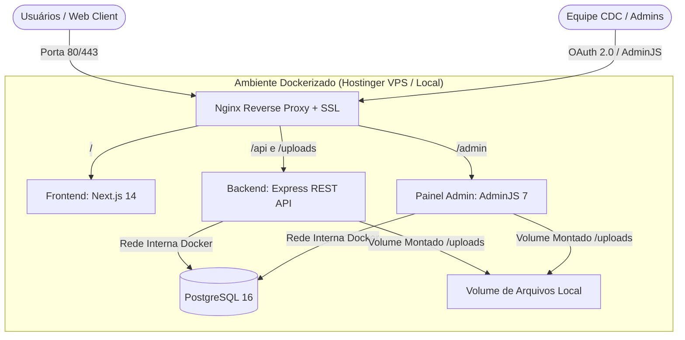
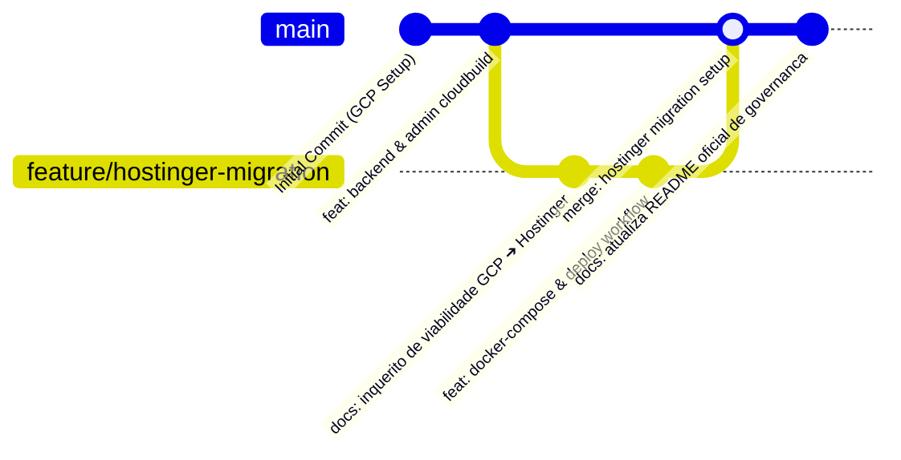

# 🏢 Site & Ecossistema CDC — Painel de Governança e Infraestrutura

Bem-vindo ao repositório oficial do **Site CDC**! Este projeto centraliza a plataforma web da ONG CDC, integrando o site institucional em Next.js, a API REST Backend em Node.js/Express, o Painel Administrativo AdminJS e os fluxos de infraestrutura e migração da GCP para a Hostinger.

---

## 🗺️ Visão Geral da Arquitetura (Mermaid Diagram)

O ecossistema é orquestrado em containers Docker, permitindo alta portabilidade entre ambientes locais de desenvolvimento e o servidor de produção Hostinger VPS:



---

## 🔀 Estratégia de Branches & Histórico Visual (Git Graph)

Padronizamos o fluxo de trabalho via Git Graph e Mermaid para garantir a transparência da evolução do código:



### Visualização Gráfica via Terminal:
Para visualizar o histórico no terminal com o padrão do projeto, utilize o alias oficial:
```bash
# Configurar alias permanente (executar uma única vez):
git config --global alias.graph "log --graph --oneline --all --decorate"

# Uso diário:
git graph
```

---

## 📂 Estrutura do Repositório

```text
site-cdc/
├── README.md                          # Painel principal de governança, arquitetura e instruções
├── docker-compose.yml                 # Orquestração de containers (Postgres, Backend, Admin, Frontend)
├── .env.example                       # Modelo de variáveis de ambiente sanitizadas
├── .github/
│   └── workflows/
│       ├── automatizar_issues.yml     # Automação idempotente de tarefas e melhorias no GitHub
│       └── deploy_hostinger.yml       # Deploy automático via SSH para a VPS Hostinger
├── docs/                              # Governança, inquéritos e sustentação do repositório
│   ├── diretrizes_documentacao.md     # Padrões editoriais, Git Graph, segurança e ADRs
│   └── inquerito_migracao_gcp_hostinger.md # Diagnóstico e plano de migração GCP ➔ Hostinger
├── frontend/                          # Aplicação Web Next.js 14 (React 18 + MUI + Axios)
├── backend/                           # API REST Node.js (Express 5 + Sequelize + Postgres)
└── painel-admin/                      # Painel Gestor AdminJS 7 (Passport Google OAuth 2.0)
```

---

## 🚀 Como Executar o Projeto Localmente

### Pré-requisitos
- **Docker** e **Docker Compose** instalados.
- **Git** configurado com chave SSH.

### Passo a Passo

1. **Clonar o Repositório**:
   ```bash
   git clone git@github.com:dxcdc/site-cdc.git
   cd site-cdc
   ```

2. **Configurar as Variáveis de Ambiente**:
   Copie o arquivo de exemplo e ajuste as credenciais necessárias:
   ```bash
   cp .env.example .env
   ```

3. **Subir os Serviços em Containers**:
   ```bash
   docker compose up -d --build
   ```

4. **Acessar as Aplicações**:
   - 🌐 **Frontend (Next.js)**: `http://localhost:3000`
   - ⚙️ **Backend API (Express)**: `http://localhost:5001`
   - 🔐 **Painel Administrativo (AdminJS)**: `http://localhost:3001`
   - 🗄️ **Banco de Dados (PostgreSQL)**: `localhost:5432`

   O endpoint de saúde da API está disponível em `http://localhost:5001/api/health`.

> Em produção, mantenha `BIND_ADDRESS=127.0.0.1` e publique os serviços somente
> por meio do proxy Nginx. Configure senhas fortes para banco, painel e cookies;
> o projeto não possui credenciais padrão de produção.

---

## 📖 Índice da Documentação (`/docs`)

Para detalhes aprofundados sobre a governança e o plano técnico, consulte os documentos na pasta `docs/`:

- [Diretrizes de Documentação & Governança](docs/diretrizes_documentacao.md) — Normas de escrita, regras de segurança, alias Git Graph e Registro de Decisões de Arquitetura (ADR).
- [Inquérito de Viabilidade & Plano de Migração GCP ➔ Hostinger](docs/inquerito_migracao_gcp_hostinger.md) — Diagnóstico dos serviços GCP atuais (Cloud Run, Cloud SQL, GCS) e roteiro de migração em 6 etapas para a Hostinger VPS.

---

## 🛡️ Regras de Segurança & Sanitização

> [!IMPORTANT]
> **Segurança por Padrão:** NUNCA adicione senhas, chaves privadas (`.pem`, `.ppk`), tokens ou arquivos `.env` reais ao Git. Todos os commits devem utilizar placeholders ou variáveis de ambiente conforme definido no `.env.example`.

---

## 🔄 Automação Idempotente de Issues via GitHub Actions

O gerenciamento de melhorias e tarefas do projeto é automatizado através do workflow `.github/workflows/automatizar_issues.yml`. As issues são verificadas via GitHub CLI (`gh issue list`) antes da criação para evitar duplicidade durante os commits da equipe.
